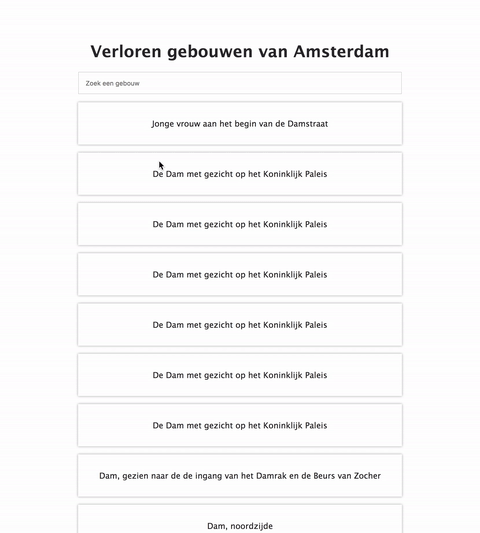
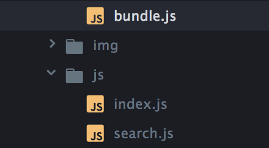
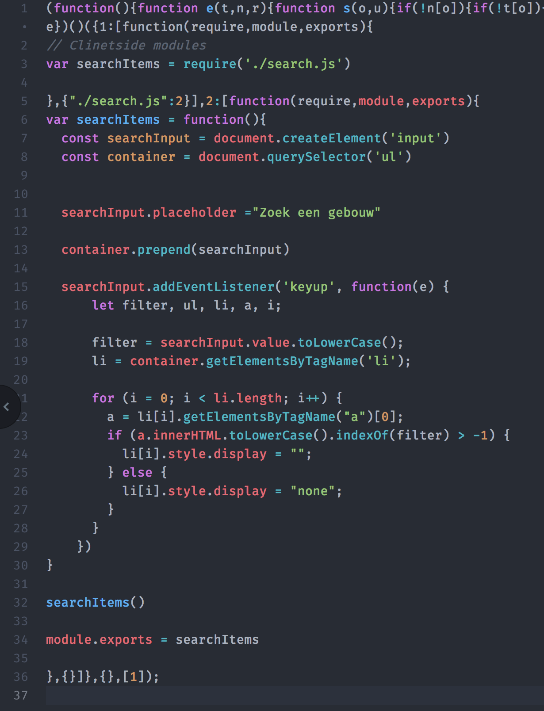

# performance-matters-server-side
Assignment: What is the core functionality of my OBA app, and how can I render it server-side?  

[Link to audit](https://github.com/Sam-Guliker/performance-matters-server-side/blob/update/audit.md)  
[Link to the user story](https://github.com/Sam-Guliker/performance-matters-server-side/blob/update/userstory.md)


The site must contain an overview page and detail page.

## Starting
Forking the repo and using `npm` to set up your dev environment
fork the repo:

```
git clone https://github.com/cmda-minor-web/performance-matters-server-side
```

### Yeoman
I wanted to try [Yeoman](http://yeoman.io/), yeoman is a tool to generate new projects with best practices.

global install:
```
npm install -g yo.
```

installing a generator.  
This generator is for an express project. You can also run different  ones such as webapp.
```
npm install --global generator-express
```
run it
```
yo express
```

Yeoman will give you different options to build your project.


#### Features of Yeoman
* Basic or MVC style file structure.
* CoffeeScript Support
* Gulp or Grunt build tools with file watching and live-reload
* Editor-config
* Support of view engines
  - Pug
  - Handlebars
  - Swig
  - EJS
  - Marko
  - Nunjucks
* Supported css pre-processors
  - Sass(Both styles)
  - LESS
  - Stylus
* Supported databases
* MongoDB
* MYSQL
* PostgreSQL
* RethinkDB
* SQLite

## Npm scripts
Running gulp


```
npm start
```

## Server-side
file structure  


## Browserify
I've build some the build.js file in browserify, I just dont know
how to run it with local host yet.  


## Client Side
I've got some enhancement with the client side.  
When you got javascript turned on you can use the search input.  


## **Update**
I added a module file, with this it will bring more structure for client-side javascript.

### Structure
  

### Bundlejs


### Progressive Web Apps (PWA)
With PWA you have access to native qualities in browsers :open_mouth:  
I've added the service workers and the manifest to the website.

### How my service worker work
On the first time the browser connects to the webpage it will cache  the basic functionality to the service worker. The next time you will visit the webpage(offline) you will get the same content as before.  The next time the app will go online the service worker will  check if there is anything to update for the offline version.

## What's up next?
### Data
I have a lot of duplicates in my data I'd like to combine  
them and push them into an `array`.

me trying really hard to fix that #$@!


### Https
for the last 100% on the [audit](https://github.com/Sam-Guliker/performance-matters-server-side/blob/update/audit.md) I can add the HTTPS.

### Routing
I had my routing fixed but unfortunately I couldn't get my fetch  
into an module. So I just used one router instead. :eyes:

### Features
* [Express](https://expressjs.com/)
* [Pug](https://pugjs.org/api/getting-started.html)
* [Path](https://nodejs.org/api/path.html)
* [bodyParser](https://github.com/expressjs/body-parser)

### License
Copyright © 2018 Sam Guliker. Released under the [MIT license](https://opensource.org/licenses/MIT)
