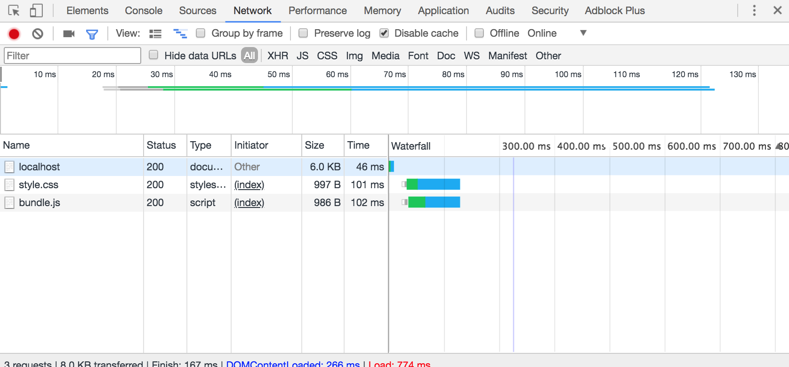
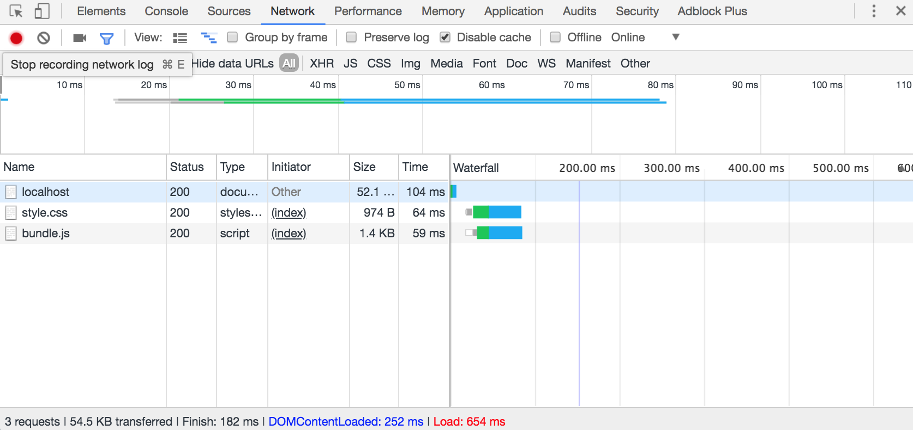
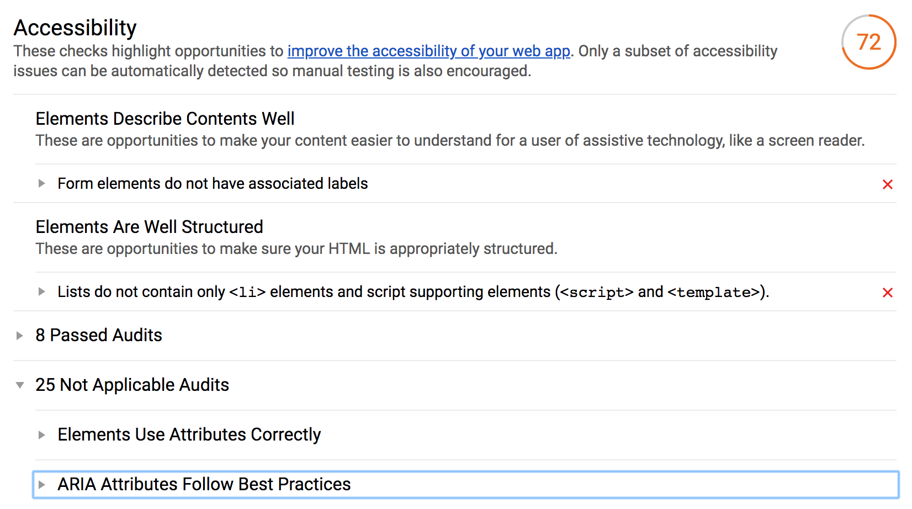
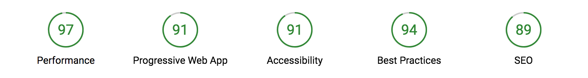
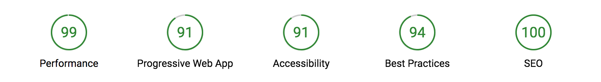

## Audit
Compression with `npm compression` will use gzip and deflate.

### Npm
```
npm install compression
```

### Api
```Javascript
var compression = require('compression')
```

### Usage
```Javascript
var compression = require('compression')
var express = require('express')

var app = express()

app.use(compression())

```
Testing with lightouse:

### Without compression


### With compression


## Speed:
### Without compression

### With compression


## Accessibility
At some point I added the label and input into the `ul`.  The accessibility dropped because of that. Switched it up to append it  into another section.



## Progressive Web Apps
Added the manifest and favicons.


## SEO
Added favicon and meta tags for SEO.  
[googledev](https://developers.google.com/web/tools/lighthouse/audits/description)

